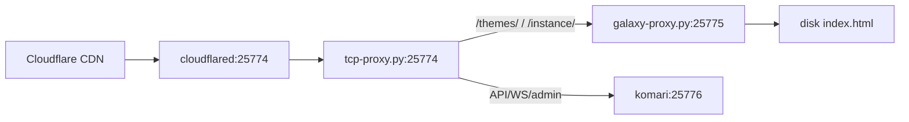

# Komari 服务器面板运维

## 何时加载
- 用户要求操作 Komari 面板服务端（非主题定制）
- 需要重置 komari admin 密码
- 需要安装/配置 komari server
- 需要排查 komari 面板问题

## ⚠️ 第一步：确认 komari server 在哪台机器上（重要）

**这是第一件事。不要假设。** 用户有多台 VPS，每台都跑 komari-agent（探针），但 **server 二进制只装在一台上**。不知道服务器在哪就盲目 SSH/启动服务会搞出重复进程，浪费大量时间。

**排查顺序（严格按此顺序，跳过一步都可能跑错服务器）：**

1. **查 memory** — memory 里有已知的面板机信息（IP、SSH端口、架构模式）。先读 memory 再动工具。
2. **查 session_search** — 最近操作记录里有迁移/部署的面板机信息。不要凭记忆猜。
3. **查 DNS** — `dig +short <监控面板域名>` 确认域名指向 Cloudflare（104.21.x.x / 172.67.x.x）
4. **查 cloudflared 进程** — 只有在面板机上才跑 cloudflared tunnel。在疑似机器上查 `ps aux | grep cloudflared`
5. **最后再 SSH** — 前面三步走完仍不确定，再 SSH 到最可能的机器验证。

**常见错误：** 看到某台 VPS 有 `komari-agent`（探针）就以为面板也在这台。所有探针机都跑 agent，面板只在一台上。agent 进程本身不代表任何东西。

**如果跑错服务器（你已经犯了）的补救措施：**
- 立即 kill 你启动的任何额外 komari server / galaxy-proxy / cloudflared 进程
- 清理你写的代理脚本（别留垃圾文件）
- 确认正确的面板机后再行动

```bash
# 正确的排查顺序：
# 1. 查 memory（本 skill 底部有「已知服务器清单」）
# 2. 查 session_search 最近操作记录
# 3. 再上服务器验证

# 验证目标机上 komari server 是否运行
ssh -p PORT user@HOST "ps aux | grep 'komari server' | grep -v grep"
# → 有输出 = 这是面板机
# → 无输出 = 只有 agent（探针），不是面板机

# 同时检查端口确认架构模式
ssh -p PORT user@HOST "netstat -tlnp | grep -E '25774|25776'"
# → 25774 + 25776 都监听 → proxy 模式（galaxy-proxy + komari）
# → 只有 25774 且进程是 komari → native 模式
# → 两个都没有 → 面板不在这个机器上
```

**记忆辅助：** 把面板机信息记入 memory（IP、SSH 端口、用户/密码、架构模式），每次排查先读 memory 再行动。

## 架构模式速查

### 用户当前架构（新加坡 isvoro，2026-05-27 简化后）

```
cloudflared (token隧道)
  ↓ :25774
komari server (原生Glass主题, 自带前端+API+WebSocket)
```

**关键点：** komari 直接监听 `:25774`，cloudflared 直连。无中间代理，少 2 个 Python 进程、2 个故障点、~24MB RSS。

**切换方式（2026-05-27）**：
```bash
# 1. 设置 DB 主题为 Glass
sqlite3 /opt/komari/data/komari.db "UPDATE configs SET value='\"Glass\"' WHERE key='theme';"

# 2. 杀旧进程
kill $(pgrep -f tcp-proxy) $(pgrep -f galaxy-proxy) $(lsof -ti:25776) 2>/dev/null

# 3. 在 25774 启动 komari（直接监听，cloudflared 连这个口）
cd /opt/komari && nohup ./komari server -l 0.0.0.0:25774 > /tmp/komari-server.log 2>&1 &

# 4. 重启 cloudflared（确保用 127.0.0.1 不是 localhost）
kill $(pgrep -f cloudflared) 2>/dev/null
sleep 5
nohup cloudflared tunnel --no-autoupdate run --token TOKEN --url http://127.0.0.1:25774 > /tmp/cf.log 2>&1 &

# 5. 验证
curl -s -o /dev/null -w '%{http_code}' https://<监控面板域名>/  # → 200
```

### 历史架构（2026-05-25 ~ 2026-05-27，已被简化替代）

```
cloudflared (token模式)
  ↓ localhost:25774
tcp-proxy.py (raw TCP, 支持 WebSocket)
  ├── /themes/, /, /instance/ → galaxy-proxy.py:25775 → 静态文件
  └── 其他(/api/, /admin/, WebSocket) → komari server:25776
```

被替代的原因：三层架构有 3 个故障点、需维护 Python raw TCP 转发、~24MB 额外 RSS、Alpine `localhost` 解析 IPv6 坑、路由维护成本高。原生 komari 主题系统成熟后（Glass 主题已适配），两架构在功能上等价，但原生更简单。

### 三层代理架构优缺点



| 方面 | 优点 | 缺点 |
|------|------|------|
| **WebSocket** | tcp-proxy 做原始 TCP 字节转发，不会吞 WS 升级握手 | — |
| **静态/API 分离** | 改前端样式不用碰后端，各改各的 | — |
| **前端可控** | galaxy-proxy 读磁盘文件，HTML/JS 随便改 | — |
| **入口统一** | 一条 cloudflared 隧道暴露一个端口 | — |
| **故障点** | — | 三个进程任一挂链路都断 |
| **调试复杂度** | — | 4 个可能的故障环节（cfd/tcp/galaxy/komari） |
| **维护成本** | — | tcp-proxy 是自写 Python raw TCP 转发，无健康检查、无自动重启 |
| **资源开销** | — | python3 × 2 + komari + cloudflared ≈ 101MB RSS |
| **IPv6 坑** | — | Alpine 上 localhost 解析到 `::1`，tcp-proxy 只监听 IPv4 |

**简化方案（推荐条件允许时）：** komari 原生主题系统直接监听 25774，主题文件放 `/opt/komari/data/theme/{short}/dist/`，cloudflared → komari 直连。少两个 Python 进程，无路由 bug，无 IPv6 坑。代价：改主题要重启 komari。

**tcp-proxy.py 路由规则：**
```python
ROUTES = {
    "/themes/": 25775,    # 主题静态文件 → galaxy-proxy
    "/": 25775,           # 页面路由 → galaxy-proxy
    "/instance/": 25775,  # 实例详情页 → galaxy-proxy
    # 未匹配的路径（/api/, /admin/, WebSocket）→ 25776（komari server）
}
```

**⚠️ 严重路由 bug（踩坑记录，2026-05-27）：** `"/": 25775` 会导致所有 API/WS 请求被错发到 galaxy-proxy。原因是 `get_target_port` 的匹配逻辑：

```python
if path == prefix.rstrip("/") or path.startswith(prefix):
```
对于 `prefix="/"`，`path.startswith("/")` 匹配所有路径（任何 URL 都以 `/` 开头）。虽然 dict 遍历顺序先检查 `/themes/` 和 `/instance/`，但其他非 API 路径（如 `/favicon.ico`、`/robots.txt`）以及 `path.startswith()` 实际上是针对 prefix 前缀的，**`"/"` 作为 prefix.startswith 永远为 true**，根本不会走到默认值 25776。所有 API 调用、WebSocket 连接都被送去 galaxy-proxy，而 galaxy-proxy（Python http.server）不支持 WebSocket，导致 agent 上报全部失败。

**现象：** `clients.updated_at` 在更新（agent 能连接），但 `records` 表完全为空；cloudflared 日志大量报 `"stream canceled by remote with error code 0"`。

**修复（2026-05-27）：** 在 `get_target_port` 函数中，对根路径 `/` 只做精确匹配，不做 startswith：
```python
if path == prefix.rstrip("/") or (prefix != "/" and path.startswith(prefix)):
```
验证结果：
- `GET / HTTP/1.1` → galaxy-proxy:25775 ✅（200）
- `GET /api/public HTTP/1.1` → komari:25776 ✅（200）
- `WS /api/clients/report?token=x` → komari:25776 ✅（401）

### 其他已知架构模式

| 模式 | cloudflared → | 中间层 | → 后端 | 适用场景 |
|------|--------------|--------|--------|---------|
| TCP proxy (当前) | `:25774` | tcp-proxy.py (raw TCP) | komari `:25776` + galaxy-proxy `:25775` | 需要 WebSocket 登录 + 自定义主题文件 |
| HTTP proxy | `:25774` | galaxy-proxy.py (HTTP) | komari `:25776` | 旧版，不支持 WebSocket 登录 |
| Native | `:25774` | 无 | komari 直接监听 `:25774` | 不需要自定义主题文件 |

#### ⚠️ cloudflared localhost → IPv6 问题（Alpine 特有）

**现象：** cloudflared 启动后用 `--url http://localhost:25774`，但请求全部 `"connection refused"`。日志显示 `dial tcp [::1]:25774: connect: connection refused`。

**根因：** Alpine Linux 的 `/etc/hosts` 中 `localhost` 默认解析为 IPv6 `::1`（而非 `127.0.0.1`）。cloudflared 尝试连接 `[::1]:25774`，但 tcp-proxy.py 绑定的是 `0.0.0.0:25774`（IPv4 only），所以连接被拒绝。Debian/Ubuntu 上 `localhost` 解析为 `127.0.0.1`，因此不受影响。

**修复：** cloudflared 启动时**永远使用显式 IPv4 地址**，不要用 `localhost`：
```bash
# ✅ 正确（IPv4 显式）
cloudflared tunnel --token TOKEN --url http://127.0.0.1:25774

# ❌ 错误（Alpine 上会走 IPv6 导致连不上）
cloudflared tunnel --token TOKEN --url http://localhost:25774
```

**诊断：**
```bash
# 查看 localhost 解析结果（Alpine）
getent hosts localhost
# → ::1                   ← 只有 IPv6，问题在此

# 确认 cloudflared 正在连接哪个地址
grep "dial tcp" /tmp/cf6.log
# → dial tcp [::1]:25774  ← IPv6，连不上
```

#### ⚠️ tcp-proxy 重启陷阱：Address already in use

**现象：** `nohup python3 tcp-proxy.py &` 启动后日志显示 `OSError: [Errno 98] Address in use`，端口 25774 无法绑定。

**根因：** 先前 kill 的 tcp-proxy.py 进程被系统残留（`SIGTERM` 没能及时释放 socket），新进程无法绑定同一端口。Python `http.server` 的 `HTTPServer` 默认在 `SIGTERM` 时不会立即释放端口。

```bash
# 诊断：找出谁占了端口
fuser 25774/tcp           # 显示 PID
netstat -tlnp | grep 25774  # 确认进程

# 修复：强杀遗留进程
kill -9 <PID>
sleep 1
# 确认端口释放
fuser 25774/tcp || echo "free"

# 重启
cd /opt/komari/scripts && nohup python3 tcp-proxy.py > /tmp/tcp-proxy.log 2>&1 &
```

注意 `fuser` 比 `pgrep` 更精准——它只找占用该端口的进程，不会误杀同名的无关进程。

### ☁️ cloudflared 隧道快速重启导致 "no more connections active and exiting"

**现象：** 连续多次重启 cloudflared 后，隧道日志显示 4 个连接都注册成功，但几秒后全部以 `"no more connections active and exiting"` 退出，返回 **530**。公网访问一直 502。

**根因：** Cloudflare 的边缘节点会缓存隧道连接状态。快速重启（几秒内重复 kill/start）会导致边缘节点认为连接已过期但仍在尝试复用旧连接，所有数据流被 cancel。每次隧道启动会与 edge 建立 4 个 QUIC 连接，若前一个隧道的连接尚未完全超时，新连接与旧连接冲突。

**修复：** 确保 kill 后等足够时间让旧连接完全释放，再启动。

```bash
# ❌ 错误：杀死后立即启动（几毫秒内）
kill $(pgrep -f cloudflared)
cloudflared tunnel ... --url http://127.0.0.1:25774  # 快速重启失败

# ✅ 正确：杀死后等待旧连接完全超时
kill -9 $(pgrep -f cloudflared) 2>/dev/null
sleep 5                          # 等边缘节点清理旧连接
# 确认无残留
pgrep -f cloudflared || echo "clean"
cloudflared tunnel --no-autoupdate run --token TOKEN --url http://127.0.0.1:25774

# ✅ 更好的做法：用 nohup + & 启动，避免背景进程被误杀
nohup cloudflared tunnel --no-autoupdate run --token TOKEN --url http://127.0.0.1:25774 > /tmp/cf.log 2>&1 &
# 验证：grep "Registered" /tmp/cf.log 应出现 4 次
```

**如果 cloudflared 已在后台模式启动且你是通过 SSH 的 background 模式启动的：** 注意 background 的 stdin/stdout/stderr 在 Hermes 侧是 pipes，cloudflared 写入 pipe 的输出会被 Hermes 的 process manager 读取。若启动命令里用了 `nohup ... > /tmp/cf.log 2>&1 &`，输出才写入日志文件。两种模式不要混用。

## 排查链路故障

当 <监控面板域名> 打不开时，逐层排查：

```bash
# 1. 域名解析
dig +short <监控面板域名>
# → 104.21.x.x / 172.67.x.x = Cloudflare CDN（正确）

# 2. cloudflared 隧道
ssh -p 10425 root@<新加坡_IP> "rc-service cloudflared status"
# → cloudflared 进程必须在面板机上运行

# 3. 本机各端口
ssh -p 10425 root@<新加坡_IP> "netstat -tlnp | grep -E '25774|25775|25776'"

# 4. 核心 API 测试
ssh -p 10425 root@<新加坡_IP> "curl -s -o /dev/null -w '%{http_code}' http://localhost:25774/"
# → 200 表示整个链正常（cloudflared → tcp-proxy → galaxy-proxy/komari）

# 5. 登录 API 测试
ssh -p 10425 root@<新加坡_IP> 'curl -s -X POST http://localhost:25774/api/login \
  -H "Content-Type: application/json" \
  -d "{\"username\":\"admin\",\"password\":\"密码在此\"}"'
# → 返回 session_token = 登录 API 正常
```

## 清库重装流程（agent 不上报数据时的最终手段）

当数据库 `records.client` 与 `clients.uuid` 大面积不匹配（10+/12 节点无数据），或者数据库来自旧备份导致 token 失效时，最简单的修复是清库重装。

```bash
# 1. 备份
cp -ra /opt/komari/data /opt/komari/data.bak
cp -ra /opt/komari/scripts /opt/komari/scripts.bak

# 2. 停止所有服务
kill $(lsof -ti:25774) $(lsof -ti:25775) $(lsof -ti:25776) 2>/dev/null
sleep 1

# 3. 清库（只删数据库，不动主题文件和代理脚本）
rm -f /opt/komari/data/komari.db /opt/komari/data/komari.db-wal /opt/komari/data/komari.db-shm

# 4. 启动 komari server（注意端口）
cd /opt/komari && nohup ./komari server -l 0.0.0.0:25776 > /tmp/komari-server.log 2>&1 &
sleep 2
curl -s -o /dev/null -w "%{http_code}" http://127.0.0.1:25776/api/public
# → 200

# 5. 设置 admin 密码
cd /opt/komari && ./komari chpasswd -p '你的密码'
# → 提示重启，kill 后重启

# 6. 重启 komari
kill $(lsof -ti:25776)
cd /opt/komari && nohup ./komari server -l 0.0.0.0:25776 > /tmp/komari-server.log 2>&1 &
sleep 2

# 7. 启动 proxy（如果使用 tcp-proxy + galaxy-proxy 架构）
cd /opt/komari/scripts && nohup python3 galaxy-proxy.py > /tmp/galaxy-proxy.log 2>&1 &
cd /opt/komari/scripts && nohup python3 tcp-proxy.py > /tmp/tcp-proxy.log 2>&1 &
sleep 2
curl -s -o /dev/null -w "%{http_code}" http://127.0.0.1:25774/  # → 200

# 8. 重启 cloudflared 隧道（如果丢失 token 需重新创建）
cloudflared tunnel --url http://localhost:25774

# 9. 验证 admin 登录
curl -s -X POST http://localhost:25774/api/login \
  -H "Content-Type: application/json" \
  -d '{"username":"admin","password":"你的密码"}'
# → {"status":"success","data":{"set-cookie":{"session_token":"..."}}}

# 10. 等待 agent 自动重新注册上报（1-5 分钟）
# 监控 records 表行数增长：
watch -n 10 "python3 -c '
import sqlite3
c = sqlite3.connect(\"/opt/komari/data/komari.db\").cursor()
r = c.execute(\"SELECT COUNT(*) FROM records\").fetchone()[0]
n = c.execute(\"SELECT COUNT(*) FROM clients\").fetchone()[0]
print(f\"Clients: {n}, Records: {r}\")
'"
```

**注意事项：**
- **cloudflared tunnel 的 token 会丢失**（进程被 kill 后 token 从进程 cmdline 也消失）。需要从 Cloudflare Dashboard 重新创建或让用户提供 token
- ⚠️ **启动 cloudflared 时永远用 `http://127.0.0.1:25774`** 而不是 `localhost`（Alpine 上 localhost 解析为 IPv6 `::1`，与 IPv4-only 的 tcp-proxy 不兼容）
- **清库后所有旧 session 失效**，用户需重新登录
- **清库后管理员密码需重新设置**（`chpasswd`）
- **主题文件不受影响**（`/opt/komari/data/theme/` 保留），galaxy-proxy 继续服务主题
- **agent 自动重新注册**：agent 连接时会自动在 `clients` 表创建新记录，无需手动添加节点
- **1-2 分钟后 records 表应有数据增长**，表示 agent 开始上报

## 密码重置

Komari 服务端二进制（43MB 左右）有 `chpasswd` 命令，**agent 二进制（11MB 左右）没有**。

```bash
# 确保用的是 server 二进制，不是 agent
/opt/komari/komari chpasswd -p '新密码' -d /opt/komari/data/komari.db
# ⚠️ 没有 -u 参数！默认只改 "admin" 用户
```

⚠️ **常见陷阱：**
- **`chpasswd` 没有 `-u` / `--user` 参数**（v1.2.0 实测），只修改 `admin` 用户
- 服务端 `/opt/komari/komari` 可能被误替换为 agent 二进制 `/opt/komari/agent`
- Agent 二进制没有 `chpasswd` 命令（只有 `check-mem`、`list-disk` 等监控命令）
- 改完密码后会提示重启服务生效（`rc-service komari restart` 或 `systemctl restart komari`）。

### ⚠️ 重启端口冲突陷阱（galaxy-proxy 模式）

**现象：** 用 `chpasswd` 改完密码后手动重启 komari，面板返回 **502 Bad Gateway**。

**根因：** komari `server` 默认监听端口是 **`0.0.0.0:25774`**。但在 galaxy-proxy 架构下，端口 25774 已被 galax-proxy 占用，komari 绑定失败后进程退出，galaxy-proxy 转发到 25776 空端口返回 502。

**修复：** 重启时显式指定端口：

```bash
# ❌ 这样会被 proxy 端口占住，启动失败
cd /opt/komari && nohup ./komari server > /dev/null 2>&1 &

# ✅ 必须指定 komari 后端端口
cd /opt/komari && nohup ./komari server -l 0.0.0.0:25776 -d ./data/komari.db > /dev/null 2>&1 &

# 验证
curl -s -o /dev/null -w "%{http_code}" http://localhost:25776/admin  # → 200
curl -s -o /dev/null -w "%{http_code}" http://localhost:25774/admin  # → 200（通过 proxy）
```

**架构确认：**
```bash
# 检查监听端口，确认谁占 25774
ss -tlnp | grep -E '25774|25776'
# → 25774: python3 (galaxy-proxy) ✔
# → 25776: komari (backend) ✔
```

### 关闭 2FA 与允许密码登录

修改密码后如果面板要求 2FA，或密码登录被禁用，还需执行：

```bash
/opt/komari/komari disable-2fa -d /opt/komari/data/komari.db
/opt/komari/komari permit-login -d /opt/komari/data/komari.db
# 改完后必须重启服务
```

### 替代方案：直接修改 SQLite

当 server 二进制不可用或没有 bcrypt 时，可用 Python 直接写库：

```bash
python3 -c "
import bcrypt, sqlite3
pw = '新密码'
hashed = bcrypt.hashpw(pw.encode(), bcrypt.gensalt()).decode()
conn = sqlite3.connect('/opt/komari/data/komari.db')
conn.execute('UPDATE users SET passwd=? WHERE username=?', (hashed, 'admin'))
conn.commit()
conn.close()
print('Password updated')
"
```

⚠️ `chpasswd` 只能改 `admin` 用户。若面板使用的是非 admin 用户名（如 `woioeow`），必须用 SQLite 直接操作。

## 服务器安装

### 下载二进制
```bash
wget https://github.com/komari-monitor/komari/releases/download/1.1.9/komari-linux-amd64 -O /opt/komari/komari
chmod +x /opt/komari/komari
```

### OpenRC 服务（Alpine Linux）
```bash
cat > /etc/init.d/komari << 'EOF'
#!/sbin/openrc-run
name="komari"
command="/opt/komari/komari"
command_args="server -l 0.0.0.0:25774"
command_background=true
pidfile="/run/${RC_SVCNAME}.pid"
EOF
chmod +x /etc/init.d/komari
rc-update add komari default
rc-service komari start
```

### Systemd 服务（Debian/Ubuntu）
```bash
cat > /etc/systemd/system/komari.service << 'EOF'
[Unit]
Description=Komari Monitor Service
After=network.target

[Service]
Type=simple
ExecStart=/opt/komari/komari server -l 0.0.0.0:25774
WorkingDirectory=/opt/komari
Restart=always
User=root

[Install]
WantedBy=multi-user.target
EOF

systemctl daemon-reload
systemctl enable --now komari
```

## GitHub SSO 问题处理

Komari 通过 OIDC Providers 实现 GitHub 单点登录，配置存储在 `oidc_providers` 表中：

```bash
# 查看所有 OIDC 提供商
sqlite3 /opt/komari/data/komari.db "SELECT rowid, * FROM oidc_providers;"
# rowid 1: Github, 2: CloudflareAccess, 3: generic, 4: qq

# 删除无效的 GitHub SSO 配置
sqlite3 /opt/komari/data/komari.db "DELETE FROM oidc_providers WHERE rowid=1;"
# 重启服务后生效: rc-service komari restart
```

故障现象：面板登录页出现 "Login with Github" 按钮但点击无响应。
根因：GitHub OAuth App 的 Client ID/Secret 已泄露或被删除，API 返回 404。
验证：`curl -sk "https://api.github.com/applications/<CLIENT_ID>"`
修复：删除 DB 记录 → 重启 komari 服务。

## Glass 主题（原名 GalaxyGlass，2026-05-20 更名）

GalaxyGlass 是 Komari 的自定义前端主题（Astro 5 + React Islands），以 Komari 原生主题方式安装，不再通过 Python 代理。

### 架构变更历史

| 时间 | 架构 | 说明 |
|------|------|------|
| ~2026-05-18 | Python proxy (`:25774`) → Komari (`:25776`) | proxy 服务静态文件并透传 API |
| 2026-05-19 ✅ | **Komari 直接监听 `:25774`** | 原生主题系统，无中间代理，CFD 隧道直连 Komari |

### 主题文件结构

```
/opt/komari/data/theme/
└── {short}/                      # short 名子目录（如 GalaxyGlass/ 或 Mochi/）
    ├── komari-theme.json          # 主题配置文件（必需字段: name, short, description, version, author）
    └── dist/
        ├── index.html             # 主页模板
        ├── detail.html            # 详情页模板
        └── _assets/               # 静态资源（Astro 构建输出）
            ├── DashboardContent.*.js
            └── ...
```

### Asset 路径冲突（重要踩坑记录）

**Komari v1.2.0 的内置 admin UI 使用 `/_next/` 路径。** 如果 Astro 构建时 `build.assets` 设为 `"_next"`，JS/CSS 文件会被 Komari 的 admin SPA catch-all 拦截，返回 HTML 而非 JS，导致 DashboardContent 水合后渲染空白。

**修复：** 在 `astro.config.mjs` 使用不冲突的路径：
```js
build: {
  assets: "_astro",  // 永远不要用 "_next"
}
```

### 架构诊断：判断目标机是 proxy 模式还是 native 模式

**为什么这是第一件事：** 如果目标机是 native 模式（komari 直接监听 25774），你 SCP 修改了 index.html 文件也完全没有效果——komari 服务的是内嵌主题，不是磁盘文件。

```bash
# 诊断命令
ssh -p PORT user@HOST "ss -tlnp | grep 25774"
# → users:((\"komari\",...))  → native 模式（内嵌主题，磁盘文件修改无效）
# → users:((\"python3\",...)) → proxy 模式（读磁盘文件，修改有效）

# 进一步确认文件是否被使用
ssh -p PORT user@HOST "wc -c /opt/komari/data/theme/index.html"

# 对比二进制大小（判断是否包含内嵌主题）
ssh -p PORT user@HOST "ls -lh /opt/komari/komari"
# 43MB = 含内嵌主题, 11MB = agent 二进制
```

如果发现是 native 模式但你期望 proxy 模式，执行下面的「部署 galaxy-proxy」流程。

### 从 native 模式切换到 proxy 模式（2026-05-19 新增）

当你需要修改磁盘主题文件生效时，必须让 galaxy-proxy.py 介于 cloudflared 和 komari 之间。

#### ⚠️ 扩展 galaxy-proxy 以代理附加后端服务

galaxy-proxy 可以代理多个后端服务，不限于 komari。通过添加额外的 `_fwd_*` 方法和路由即可。示例 — 添加 IP-Sentinel webhook 代理：
​```python
# 1. 添加常量
SENTINEL_BACKEND = "http://127.0.0.1:42186"

# 2. 添加转发方法
class PH(http.server.SimpleHTTPRequestHandler):
    def _fwd_sentinel(self, method):
        url = SENTINEL_BACKEND + self.path
        # ... 同 _fwd() 实现（GET/POST/PUT 等）

    def do_GET(self):
        # 3. 在 API 路由之前添加 sentinel 检查
        if clean_path.startswith("/sentinel/"):
            return self._fwd_sentinel("GET")
        # ... 后续原有路由

    def do_POST(self):
        # 4. POST 需单独处理（do_POST 默认全部发到 komari）
        parsed = urlparse(self.path)
        if parsed.path.startswith("/sentinel/"):
            return self._fwd_sentinel("POST")
        self._fwd("POST")
​```
**关键点：** `do_POST` 默认全部转发到 komari，额外后端需要单独处理 POST 路由。sentinel webhook 需用 `127.0.0.1` 而非 `localhost` 避免 IPv6 解析问题。新路由必须排在 API 路由检查前（galaxy-proxy 的 catch-all 会拦截未知路径）。

**⚠️ 为什么要切 proxy 模式：komari 内嵌 JS 模板 bug**

Komari 二进制（v1.2.0）的嵌入式 JS 模板在渲染节点名称时，**硬编码了 `\'` 前缀**，导致所有卡片名称前面多一个单引号：

```
// 原始模板（komari 二进制内嵌）
\'+(n.name||n.uuid||'—')
// → 渲染结果: '无聊云 | 洛杉矶

// 修复后（磁盘 index.html）
''+(n.name||n.uuid||'—')
// → 渲染结果: 无聊云 | 洛杉矶
```

**数据库中的名字是干净的**（无前导单引号），问题出在 komari 二进制的模板字符串。唯一的修复方式是用 proxy 模式服务磁盘上的 index.html，绕过 komari 的内嵌模板。

```bash
# 1. 确认 galaxy-proxy.py 存在
ls -lh /opt/komari/galaxy-proxy.py

# 2. 如果不存在，从本地同步（注意 BACKEND 端口）
# BACKEND = "http://localhost:25776"  (让 proxy 将 API 转发到 25776)
# 服务端口 25774 (让 proxy 在这监听，cloudflared 连这个口)

# 3. SSH 到远程服务器
ssh -i ~/.ssh/hermes_admin -p 46748 root@<荷兰_IP>

# 4. 停止 native komari 释放 25774
kill $(ss -tlnp | grep ':25774 ' | grep -oP 'pid=\K[0-9]+')
# Alpine: kill $(lsof -ti :25774)

# 5. 在 25776 启动 komari（后端 API 模式）
cd /opt/komari
nohup ./komari server -d ./data/komari.db -l 0.0.0.0:25776 > /dev/null 2>&1 &

# 6. 在 25774 启动 galaxy-proxy
cd /opt/komari/data/theme
nohup python3 galaxy-proxy.py > /dev/null 2>&1 &

# 7. 验证端口
ss -tlnp | grep -E '25774|25776'
# → 25774: python3 (galaxy-proxy)
# → 25776: komari (backend)

# 8. 🔁 检查 cloudflared 隧道——切换时可能因后端短暂不可用而断开
rc-service cloudflared status
# 如果挂了，重启：
rc-service cloudflared restart

# 9. ✅ 验证公网
curl -s -o /dev/null -w '%{http_code}: %{size_download}B' https://<监控面板域名>/
# → 200: 98xxxB

# 10. 验证单引号已消失（SSR 渲染的名称不应有 ' 前缀）
curl -s https://<监控面板域名>/ | grep -o 'node-name">[^<]*' | head -5
# → node-name">无聊云 | 洛杉矶   (无前导 ' )
# → node-name">Acck | 东京        (无前导 ' )

# 验证 JS 模板也修了
curl -s https://<监控面板域名>/ | grep -o "n\.name||n\.uuid[^;]*"
# → 应为 ''+(n.name||n.uuid||'—')   (无 \' 前缀)
```

**关键点：** cloudflared 隧道一直连的是 25774，切换时隧道可能因为后端短暂不可用而断开，务必检查并重启 rc-service cloudflared restart。

**关键点：** cloudflared 隧道一直连的是 25774，不管背后是 komari 还是 proxy。切换时隧道不受影响。

### 从旧架构迁移（proxy → 原生主题）

```bash
# 1. 停止 proxy
pkill -f galaxy-proxy

# 2. 清理旧文件（在远程上）
rm -rf /opt/komari/data/theme/_next /opt/komari/data/theme/index.html

# 3. 确认 Komari 直接监听 25774（无 proxy 占位）
# 如果 proxy 占着 25774，先杀 proxy 再启 komari
```

```bash
# 1. 停止 proxy
pkill -f galaxy-proxy

# 2. 清理旧文件（在远程上）
rm -rf /opt/komari/data/theme/_next /opt/komari/data/theme/index.html

# 3. 确认 Komari 直接监听 25774（无 proxy 占位）
# 如果 proxy 占着 25774，先杀 proxy 再启 komari


### 🇹🇼 国旗 / 旗帜图标不显示

**现象：** 分组筛选按钮中台湾（或其他新地区）的旗帜图标不显示，只有 emoji 裸字符。
**根因：** `flagEmoji()` 函数缺少对应国旗 emoji → country code 的映射。

**修复：** 在 `config.js` 或 `index.html` 的 `flagEmoji` 函数中添加映射条目：

```javascript
// 在 emojiToCode 对象中增加
'🇹🇼':'tw'  // 台湾
// 示例：function flagEmoji(r) { var m = {'🇺🇸':'us', ..., '🇹🇼':'tw'}; return m[r] || ''; }
```

**排查步骤：**
1. 通过浏览器控制台检查实际部署的 `flagEmoji`：`String(flagEmoji)` 查看部署的函数
2. 检查 API 中节点的 `region` 字段值：`/api/nodes` → 每个节点的 `region` 是 emoji 还是文本
3. `flagEmoji` 函数在 `config.js` 或内联在 `index.html` 中（根据是否使用多文件架构）
4. 如果使用 Python 代理 + 多文件架构，修改后需更新服务器 `/opt/komari/data/theme/scripts/config.js`
5. 如果使用单文件 `dist/index.html`，修改后需上传到服务器对应路径
6. **Cloudflare 可能缓存旧文件**：静态文件 URL 加 `?v=N`（N 递增）或代理返回 `Cache-Control: no-cache` 头

### ⚠️ index.html 内联 JS 脏字符陷阱（新发现 2026-05-26，2026-05-27 更新）

**现象：** 页面加载但所有交互失效（点击卡片、搜索、排序、过滤全部无响应），控制台无报错。JS 根本就没跑起来。

**根因：** 手工编辑 `index.html` 时，在 `<script>` 块的执行语句前**多了一个脏字符**（如 `|` 管道符），导致整个 `<script>` 标签**解析失败**，所有函数（loadData、setupEvents、renderCard 等）永不定义。

```diff
- |setupEvents();setupScroll();loadData()...
+ setupEvents();setupScroll();loadData()...
```

`|` 在 JS 中不是合法的语句起始符（它是二元运算符），整个解析过程报错退出。而页面中的**预渲染 HTML 正常显示**（节点卡片、统计栏等是服务端渲染的），用户能看到数据但无法交互。

**影响两个文件（都改过了但都复发）：**
- proxy 模式：`/opt/komari/data/theme/index.html`
- native 模式：`/opt/komari/data/theme/{short}/dist/index.html`（如 `Glass/dist/index.html`）

修改后**必须重启 komari** 才能生效（native 模式读取磁盘文件，重启后生效）。

**排查方法：**
```bash
# 检查脚本最后一个语句块是否有脏字符
grep -n "^|" /opt/komari/data/theme/index.html
# 如果找到 → 删除该字符

# 用 Python validate 语法（注意 Python compile() 不能验证 JS！这是坑）
# ❌ 错误做法: python3 -c "compile(js, 'test', 'exec')"
# ✅ 正确做法: 用 node --check 或浏览器实际测试
```

⚠️ **Python 的 `compile()` 编译的是 Python 不是 JS！** 不要用它验证 JS 语法——它会对 `var`、`function` 等 JS 关键字报错，导致你误以为 JS 有问题。

**修复后验证：**
```bash
# 确认脏字符已删除
grep -c "^|" /opt/komari/data/theme/index.html  # 应为 0

# 确认执行语句正常开始
grep "setupEvents()" /opt/komari/data/theme/index.html | head -1
# → setupEvents();setupScroll();...  （无前导字符）
```

### 部署陷阱（必读）

1. **`/_next/` 路径冲突** — Komari 内置 admin UI 使用 `/_next/` 路径。如果 Astro 构建时 assets 设为 `_next`，JS/CSS 会被 admin SPA catch-all 拦截。**必须改用 `_astro` 或其他不冲突路径。**

2. **Astro assets 路径必须与 HTML 引用一致** — 修改 `astro.config.mjs` 中的 `build.assets` 后，重新构建会自动更新所有 `index.html` 和 `detail.html` 中的引用路径，无需手动修改 HTML。

3. **主题目录结构** — Komari 原生主题系统要求文件在 `/opt/komari/data/theme/{short}/dist/` 下，不是直接在 `/opt/komari/data/theme/` 根目录。

4. **重启生效** — 修改主题文件后需重启 Komari 服务才能生效：`pkill -f 'komari server' && sleep 2 && cd /opt/komari && ./komari server -l 0.0.0.0:25774 -d ./data/komari.db`

### 主题修改流程

```bash
# 1. 编辑 Astro 源码
cd /home/woioeow/galaxy-glass/astro
vim src/components/Dashboard.tsx   # 主仪表盘组件

# 2. 构建
pnpm run build

# 3. 部署
bash deploy.sh

# 4. 验证
ssh -p 46748 root@<荷兰_IP> "curl -s http://localhost:25774/ | grep -o 'astro-island' | wc -l"
```

### Footer 站点运行时间始终显示 0 日

**根因：** `config.js` 中 `siteStart` 初始化为当前时间戳，相减为 0。

**修复：** 改为站点首次上线的真实时间：

```js
var siteStart = new Date("2026-05-08T03:28:02Z").getTime();
```

### 响应式断点

CSS 只在 3 个断点控制，不设多余分段：

| 断点 | 卡片列数 | 统计栏 | 详情页 |
|:----:|:--------:|:------:|:------:|
| ≥1024px | 4列（auto-fill） | 4列 | 左1.2fr 右0.8fr |
| 640-1023px | 2列 | 4列 | 单列 |
| <640px | 1列 | 2列 | 单列，紧凑 |

### 二进制版本差异

⚠️ komari 二进制有 server（43MB）和 agent（11MB）之分。代理依赖 server 二进制。

```bash
# 确认是 server 二进制
/opt/komari/komari --help 2>&1 | grep -c server
# → 1+ = server, 0 = agent
ls -lh /opt/komari/komari
# → 43MB server, 11MB agent
```

### 迁移后节点无上报数据（新数据库，agent 未报告）

**现象：** `/api/nodes` 返回 12 个节点，但 `/api/recent/{uuid}` 全部返回 `{"status":"success","message":""}`（无 `data` 字段）。面板显示所有节点离线/零数据。

**根因：** komari 数据库是迁移/重建后的（nodes/clients 已注册），但各台 VPS 上的 komari-agent 尚未向新服务器上报过实时数据。

**诊断流程：**

```bash
# 1. 确认数据库里有多少节点注册
ssh -p 10425 root@<新加坡_IP> \
  "python3 -c '
import json, urllib.request
nodes = json.loads(urllib.request.urlopen(\"http://127.0.0.1:25776/api/nodes\").read())
print(f\"Nodes: {len(nodes.get(\\\"data\\\",[]))}\")
'"

# 2. 检查 records 表有多少 client 有数据
ssh -p 10425 root@<新加坡_IP> \
  "sqlite3 /opt/komari/data/komari.db 'SELECT COUNT(DISTINCT client) FROM records;'"
# → 如果远小于 clients 表行数 → 大部分 agent 没上报

# 3. 抽样检查单个节点
ssh -p 10425 root@<新加坡_IP> \
  "python3 -c '
import json, urllib.request
nodes = json.loads(urllib.request.urlopen(\"http://127.0.0.1:25776/api/nodes\").read())
n = nodes[\"data\"][0]
r = json.loads(urllib.request.urlopen(f\"http://127.0.0.1:25776/api/recent/{n[\\\"uuid\\\"]}\").read())
has_data = \"data\" in r and r[\"data\"]
print(f\"{n[\\\"name\\\"]}: {\"有数据\" if has_data else \"无上报\"}\")
'"
```

**可能的修复：**

| 场景 | 修复 |
|------|------|
| 所有 agent 都指向正确 endpoint，只是刚迁移完，等待几分钟 | 等 60 秒后重试 `/api/recent/{uuid}` |
| agent 指向旧面板地址 | 批量更新所有 agent endpoint（见「批量更新所有 Agent endpoint」） |
| cloudflared 隧道刚重建，agent 还没重连 | 重启 agent: `rc-service komari-agent restart` 或 `systemctl restart komari-agent` |
| 数据库是旧备份，agent token 不匹配 | 重新从面板生成 Install command，用新 token 部署 agent |

**⚠️ 重要：** `records` 表（实时数据，每节点 1 行）的 `client` 字段必须匹配 `clients` 表的 `uuid` 字段。如果数据库是恢复的旧备份，可能 `records` 的 `client` 值与当前 `clients.uuid` 不匹配，导致 `/api/recent/{uuid}` 返回空。

**诊断命令（python3 代替 sqlite3）：**
```bash
python3 -c "
import sqlite3, sys
db = '/opt/komari/data/komari.db'
c = sqlite3.connect(db).cursor()
client_uuids = set(r[0] for r in c.execute('SELECT uuid FROM clients').fetchall())
record_clients = set(r[0] for r in c.execute('SELECT DISTINCT client FROM records').fetchall())
match = client_uuids & record_clients
only_clients = client_uuids - record_clients
only_records = record_clients - client_uuids
print(f'Clients: {len(client_uuids)}, Records: {len(record_clients)}')
print(f'Match: {len(match)}, Clients only: {len(only_clients)}, Records only: {len(only_records)}')
if only_records:
    print(f'Records with unknown clients: {list(only_records)[:3]}')
"
```

如果 `Clients only` 远大于 `Match`（如 10 vs 2），说明大部分 agent 从未向这台 komari 上报过数据。根本修复是清库重装（见上方「清库重装流程」）。
   import sys, re
   html = sys.stdin.read()
   m = re.search(r'<script>(.*?)</script>', html, re.DOTALL)
   if m: open('/tmp/check.js','w').write(m.group(1))
   "
   node --check /tmp/check.js
   # 无输出 = 通过，有 SyntaxError = 需要修复
   ```

5. **CSS 缩写 `padding` 覆盖容器水平边距** — `.container` 类设定了水平 `padding: 0 var(--container-pad)` 供导航栏/底部栏/主内容区共用。如果对子元素设 `padding: N 0`（如 `.main { padding: 1.5rem 0; }`），**缩写会覆盖**父容器的水平 padding，导致主内容贴边而导航栏/底部栏正常。必须用 longhand 只改垂直方向：`padding-top: N; padding-bottom: N;`。修改后用 `getComputedStyle().paddingLeft` 验证左右 padding 一致。

6. **Canvas 图表颜色与 CSS 变量同步** — `drawLineChart()` / `drawNetChart()` 硬编码颜色（Canvas API 不读取 CSS 变量）。修改 `--accent` / `--accent-2` 等 CSS 根变量时，必须同步更新 JS 中的硬编码色值。用 `grep '#颜色值' index.html` 确认所有旧色值已被替换。

## Web 面板节点状态检查

### 入口与登录

1. 访问 `https://<监控面板域名>`
2. 点击右上角 **「登录」** → 输入用户名 `admin` 和密码（存 memory）
3. 登录后显示节点卡片仪表盘 = 在线状态一目了然

### 两种视图

| 视图 | 路径 | 用途 |
|------|------|------|
| **卡片仪表盘**（首页） | `/` | 快速浏览所有节点在线状态、CPU/内存/硬盘使用率、网络流量、运行时间 |
| **Server 节点列表** | 侧栏 → **「Server」** | 表格视图含：状态指示灯、IP 地址、Client 版本、分组、计费、操作按钮 |

### 状态指示灯颜色含义

- **绿色圆点** → 在线（agent 心跳正常上报）
- **红色圆点** → 离线（agent 无心跳上报超时）

### 离线节点诊断流程

当面板显示某节点离线时，按以下顺序排查：

```bash
# 第1步：确认 vs ping（ICMP 不可靠，不能作为判定依据）
ping -c 2 -W 3 <IP>      # ❌ 即使不通也不代表离线

# 第2步：查数据库确认节点信息
sqlite3 /opt/komari/data/komari.db "
  SELECT uuid, name, ipv4, ipv6, updated_at FROM clients WHERE name LIKE '%关键词%';
"

# 第3步：从主控 SSH 测 agent 真实端口
timeout 5 bash -c 'echo > /dev/tcp/<IP>/35776' 2>/dev/null && echo "端口开" || echo "端口关"

# 第4步：查 API 是否有上报数据
curl -s http://主控IP:PORT/api/recent/<uuid> | python3 -c "
import json,sys
d=json.load(sys.stdin).get('data',[])
print(f'有 {len(d)} 条数据' if d else '无上报 - agent 可能挂了')
"
```

### SSH 端口发现模式

当标准 SSH 端口（22）不通时，使用以下顺序扫描发现：

```bash
# 1. 先试标准端口
timeout 3 nc -zv <IP> 22 2>&1

# 2. 很多 VPS（GCP、ColoCrossing NAT）用 2222
timeout 3 nc -zv <IP> 2222 2>&1

# 3. GCP VM 有时用 43590 或其他高端口
timeout 3 nc -zv <IP> 43590 2>&1

# 4. 已知非常规端口模式
#    - 无聊云|洛杉矶 (56idc-la): 2222
#    - 台湾 GCP VM: 43590（主）和 2222（iptables NAT 映射）
#    - 荷兰主控 (<荷兰_IP>): 46748
#    - 亚特兰大 (<亚特兰大_IP>): 53621 (woioeow 用户)

# 5. 还不行就扫 top 20 端口
for port in 22 2222 22222 443 80 8080 35776 43621 53621 58193 47283 63841 27391 42185 46748 43590; do
  timeout 2 bash -c "echo >/dev/tcp/<IP>/$port" 2>/dev/null && echo "OPEN: $port"
done
```

### ⚠️ ssh-agent 认证坑（重要）

**现象：** `ssh -i ~/.ssh/hermes_admin root@host -p 43590` 返回 `Permission denied (publickey,keyboard-interactive)`，但实际密钥是有效的。

**根因：** OpenSSH 在直接 `-i` 指定密钥时，某些服务器配置下认证可能失败。将密钥加入 ssh-agent 后再连接即可成功。

**修复：**
```bash
eval $(ssh-agent -s)
ssh-add ~/.ssh/hermes_admin    # 可能需要先 ssh-add -l 查看已加载的密钥
ssh -o StrictHostKeyChecking=no -p 43590 root@<IP>
```

**注意：** 这是标准 SSH 行为，不是 bug。当 agent 持有密钥时，SSH 客户端可以向服务器提供多种签名算法选择，增加认证成功率。对 `hermes_admin` 密钥尤其常见。**不要遇到就换密码认证 — 用户说"你直接登就行"时先试 agent。**

### 密码认证 SSH（凭据已存 memory）

部分 VPS 使用密码而非密钥认证。凭据存储在 memory 中，格式如下：

```
<名称>(<IP>:<端口>, <用户名>/<密码>, <备注>)
```

**查找方式：** 用 `memory` 工具查看，或搜 `session_search`。用户预期 Agent 自动保存所有管理的小鸡凭据。

**已知密码认证节点：**
- 台湾 GCP (<台湾_IP>:43590, root/pwZv8%%crNf$$NFF)
- 新加坡 isvoro (<新加坡_IP>:10425, root/jZmogE2tU94HJibt)
```

### 状态判断矩阵（从主控 SSH 侧测试）

| Ping | SSH (22) | Agent 端口 (35776) | 结论 | 修复 |
|------|----------|---------------------|------|------|
| ❌ | ❌ | ❌ | **网络不通** — VPS 关机/母鸡宕机 | 进提供商面板重启 |
| ✅ | ❌ | ❌ | **LXC 容器进程全崩** — 内核活着但用户态挂了 | 提供商面板重启容器 |
| ✅ | ✅ | ❌ | **Agent 未运行** — 进程挂了/未安装 | SSH 进去查 `/opt/komari/agent` 是否存在，再启动 |
| ✅ | ✅ | ✅ | 节点正常，查其他原因 | — |

### Alpine LXC 上 Agent 恢复（无 systemd 环境）

当确认 agent 二进制存在于 `/opt/komari/agent` 但进程不存在时（Alpine Linux LXC）：

**获取 token 和 endpoint：**
1. 登录面板 admin（`<监控面板域名>` → 登录）
2. 侧栏 → **Server**
3. 搜索节点名
4. 点击右列 **Install command** 按钮
5. 复制命令中的 `--http-server <endpoint> -t <token>` 部分

**启动 agent（Rust 版，1.2MB）：**
```bash
# Alpine 无 bash/systemctl/journalctl，用 nohup 启动
nohup /opt/komari/agent --http-server https://<监控面板域名> --tls -t <TOKEN> --disable-network-statistics > /tmp/komari-agent.log 2>&1 &

# 验证
ps aux | grep agent
cat /tmp/komari-agent.log
# 成功的标志: "Successfully pushed Basic Info"
```

**验证日志的关键行：**
```bash
cat /tmp/komari-agent.log
# ✅ "Successfully pushed Basic Info" → 数据上报正常
# ✅ 持续输出网络/CPU 实时数据 → 实时监控正常
# ❌ 只有启动信息没有后续 → agent 连不上面板，检查 --http-server 和网络
```

**设置开机自启（Alpine OpenRC 方式）：**
```bash
echo '/opt/komari/agent --http-server https://<监控面板域名> --tls -t <TOKEN> --disable-network-statistics > /tmp/komari-agent.log 2>&1 &' > /etc/local.d/komari.start
chmod +x /etc/local.d/komari.start
rc-update add local default
```

**设置开机自启（Alpine OpenRC 方式）：**
```bash
echo '/opt/komari/agent -e https://<endpoint> -t <token> > /opt/komari/agent.log 2>&1 &' > /etc/local.d/komari.start
chmod +x /etc/local.d/komari.start
rc-update add local default
```

**注意：**
- Alpine 无 systemctl，`systemctl status` 返回 `not found`
- Alpine 无 journalctl，查看日志直接 `cat /opt/komari/agent.log`
- Alpine 无 bash，用 `sh` 替代（install.sh 的 pipe 到 bash 会失败）
- 如果 agent 二进制不在 `/opt/komari/agent`，从面板重新生成安装命令（含正确的 token），用 `wget -qO- <install_url> | sh -s -- -e <endpoint> -t <token>`

### Agent 上线验证清单

启动 agent 后按以下步骤确认：

```bash
# 1. 检查进程
ps aux | grep komari

# 2. 检查日志关键行
cat /opt/komari/agent.log
# 成功标志:
#   "Get IPV4 Success: <IP>"        → agent 拿到本机IP
#   "Basic info uploaded successfully"  → 首次上报成功
#   "WebSocket connected"           → 实时通道建立

# 3. 面板验证（浏览器）
# 登录 <监控面板域名> → 主面板 → 搜索节点名
# 确认节点卡片显示非零的 CPU/内存/硬盘数据

# 4. 验证数据持续上报（等 30-60 秒）
# 再次 cat agent.log，应有新的上报记录
```

**常见失败模式：**
- 日志停在 `Get IPV4 Success` → agent 无法连接面板 endpoint（检查 -e 参数和网络）
- 日志停在 `Checking update...` → DNS 解析失败或面板不可达
- 面板显示节点但数据全 0 → agent 刚启动，等 30-60 秒
- 进程存在但面板显示离线 → agent 心跳超时，检查 endpoint/token 是否正确

### ARM64 架构（Alpine LXC）Agent 部署

当目标机器是 ARM64（aarch64）架构时，需手动下载对应的 Rust agent 二进制：

```bash
# 1. 确认架构
uname -m
# → aarch64 = ARM64

# 2. 下载 Rust agent（1.2MB，正确来源）
wget -O /opt/komari/agent https://github.com/GenshinMinecraft/komari-monitor-rs/releases/download/latest/komari-monitor-rs-linux-aarch64-musl
chmod +x /opt/komari/agent

# 3. 启动
nohup /opt/komari/agent --http-server https://<监控面板域名> --tls -t <TOKEN> --disable-network-statistics > /tmp/komari-agent.log 2>&1 &

# 4. 验证架构是否正确
file /opt/komari/agent
# → ELF 64-bit LSB executable, ARM aarch64
```

**已知 ARM64 环境：**
- isvoro 新加坡 LXC（Alpine 3.17, ARM64）

### ⚠️ 常见误区：用 ping 判断离线

**ICMP (ping) 不可靠。** 大多数 VPS 提供商（ColoCrossing、RackNerd 等）默认屏蔽 ICMP。ping 不通 ≠ 节点离线。

真正判定离线的标志：
1. Agent 端口（35776）TCP 连接超时
2. `/api/recent/<uuid>` 返回空数组且持续超过 agent 上报间隔（通常 60s）
3. 面板状态指示器红色（靠 agent 心跳判断，不是 ping）

### 用户已知节点清单（14 → 12 个，2026-05-25 更新：已删除平壤，新增新加坡凭据）

| 名称 | 区域 | IP | SSH 端口 | 特征 |

| 名称 | 区域 | IP | 特征 |
|------|------|----|------|
| 无聊云 \\| 洛杉矶 | 🇺🇸 US | <洛杉矶2_IP> | **2222** | NAT VPS，小磁盘 ¥10/年 |
| Acck \\| 东京 | 🇯🇵 JP | <东京_IP> | 22 | 9929 线路 ¥148.88/年 |
| RackNerd \\| 纽约 | 🇺🇸 US | <纽约_IP> | 22 | $10.6/年 |
| ColoCrossing \\| 洛杉矶 | 🇺🇸 US | <洛杉矶1_IP> | 22 | 右护法 $10/年 |
| HostVDS \\| 堪萨斯 | 🇺🇸 US | <KS_IP> | 22 | $0.99/月 |
| 野草云 \\| 香港 | 🇭🇰 HK | <香港_IP> | 22 | 主力节点 ¥297/3年 |
| RackNerd \\| 亚特兰大 | 🇺🇸 US | <亚特兰大_IP> | 22 → **53621**（woioeow） | 大硬盘 $18.66/年 |
| ColoCrossing \\| 洛杉矶2 | 🇺🇸 US | <运维本机_IP> | 22 | $29/年 |
| DediRock \\| 洛杉矶 | 🇺🇸 US | <旧Master_IP> | 22 | cloudflared 隧道 $6.45/年 |
| 无聊云 \\| 阿姆斯特丹 | 🇳🇱 NL | <荷兰_IP> | **46748** | **Komari 主控** ¥10/年 |
| 无聊云测试 \\| 台湾 | 🇹🇼 TW | <台湾_IP> | **43590**（主）/ 2222（NAT） | GCP 永久免费 Alpine LXC, 内网 10.171.50.145, 密码认证 |
| isvoro \\| 首尔 | 🇰🇷 KR | <首尔_IP> | 22 | ¥0.18/月, Agent 掉线, 密钥未知 |
| isvoro \\| 新加坡 | 🇸🇬 SG | <新加坡_IP> | **10425** | ¥0.18/月, ARM64 Alpine LXC, **重装后密码已更新** |

## 故障排查

### Admin 面板空白（/admin 显示空白或 GalaxyGlass 节点列表而非后台）

**现象：** 访问 `/admin` 路径时，浏览器显示空白页（仅 `<div id="root">`），或看到 GalaxyGlass 探针卡片界面。URL 正确，页面 title 为 "Komari Monitor" 或 "GG 探针"，但无法进入管理后台。API 登录正常（`/api/login` 返回 session_token）。

**两种根因：**

**根因 A — Proxy 漏掉 /assets/ 透传（最常见）：**
Komari v1.2.0 的 admin 面板是独立的 **React SPA**（Vite 构建，与 GalaxyGlass 完全不同的前端框架）。它的入口 HTML 在 `/admin` 返回，但引用的 JS/CSS 在 `/assets/` 路径下。如果 Python proxy 的 catch-all 拦截了 `/assets/*` 请求并返回 GalaxyGlass 的 index.html，React 应用无法初始化，页面显示空白。

```bash
# 诊断：对比 /admin 和主页的大小确定是否是 SPA 拦截
curl -s http://localhost:25774/admin | wc -c   # 2-3KB → 被 SPA catch-all 拦截（返回错误的 HTML）
curl -s http://localhost:25774/ | wc -c        # 80+KB（GalaxyGlass 前端）

# 确认 assets 返回 JS 而非 HTML
curl -sI http://localhost:25774/assets/entry-index-CN3NDSn4.js | grep Content-Type
# → text/html → 被截获！ 应返回 application/javascript
```

**修复 A：** 在 proxy 的 `do_GET` 中添加 `/assets/`、`/registerSW.js`、`/manifest.webmanifest` 透传（详见上方「SPA 路由行为验证」代码示例），重启 proxy。

**根因 B — Komari 嵌入式主题覆盖 /admin：**
Komari v1.2.0 通过 Go embed 将 GalaxyGlass 编译进二进制。当主题嵌入后，**所有非 API 路由**（包括 `/admin`、`/manifest.json`）都返回 GalaxyGlass SPA HTML，admin 面板无法通过 `/admin` 路径访问。

```bash
# 诊断：确认二进制大小（判断是否包含编译主题）
ls -lh /opt/komari/komari
# → 43MB → 主题编译进二进制

# 检查 /admin 实际返回的内容
curl -s http://127.0.0.1:25776/admin | head -10
# 如果包含 <meta name="author" content="Akizon77" /> 说明是 GalaxyGlass 而非 admin
```

**修复 B：** 删除数据库中的 GalaxyGlass 主题配置，让 komari 回退到内置的默认 admin 主题：

```bash
# 1. 停服务（避免数据库锁）
rc-service komari stop

# 2. 删除 GalaxyGlass 主题配置
sqlite3 /opt/komari/data/komari.db 'DELETE FROM theme_configurations;'

# 3. 可选：清空 theme 配置
sqlite3 /opt/komari/data/komari.db "UPDATE configs SET value='' WHERE key='theme';"

# 4. 启动 komari（注意核对端口与 OpenRC 脚本一致）
start-stop-daemon --start --background --make-pidfile --pidfile /run/komari.pid \
  --exec /opt/komari/komari -- server -l 0.0.0.0:25776 -d /opt/komari/data/komari.db

# 5. 验证 admin 面板恢复
curl -sI http://127.0.0.1:25776/admin | head -1
# → HTTP/1.1 200 OK → 正常返回 admin HTML
curl -s http://127.0.0.1:25776/admin | grep 'entry-index'
# → 出现 <script type="module" crossorigin src="/assets/entry-index-..."> → 正确

# 6. 如果 proxy 也配了 /admin 透传，完整的链是：
#    用户 → <监控面板域名>/admin → proxy(:25774) → komari(:25776) → admin SPA
```

**恢复后效果：**
- `<监控面板域名>/` → GalaxyGlass 探针前端（由 Python 代理从 `/opt/komari/data/theme/index.html` 服务）
- `<监控面板域名>/admin` → Komari admin 管理后台（由 komari 后端返回默认主题，代理透传）
- API 和数据上报不受影响（Python 代理仍然透传 `/api/`）

**原理：** Komari v1.2.0 的二进制同时包含「default」和「GalaxyGlass」两套主题。`theme_configurations` 表决定激活哪个。删除该记录后，komari 回退到内置的默认 admin 主题。GalaxyGlass 前端由 Python 代理独立服务，不受影响。

**⚠️ 注意：** 修复 B 后如果 proxy 的 `do_GET` 缺少 `/assets/` 透传，admin 页面仍会空白（触发根因 A）。两条修复可能需要一起做。

### 面板打不开
1. 检查 cloudflared 隧道：`systemctl status cloudflared` 或 `rc-service cloudflared status`
2. 检查 komari 服务：`systemctl status komari` 或 `rc-service komari status`
3. 检查端口监听：`netstat -tlnp | grep 25774`
4. 确认 DNS 指向正确的服务器 IP

### Admin API 编程登录

当需要通过 API 管理面板（非浏览器登录）时，可以使用以下流程：

```bash
# 1. 发送登录请求获取 session_token
curl -s 'http://服务器IP:端口/api/login' \
  -X POST \
  -H 'Content-Type: application/json' \
  -d '{"username":"admin","password":"你的密码"}'
# 返回: {"status":"success","data":{"set-cookie":{"session_token":"xxx"}}}

# 2. 使用 session_token 访问受保护端点
curl -s 'http://服务器IP:端口/admin' \
  -H 'Cookie: session_token=你的token'
# 返回管理后台页面

# 3. 用 session_token 调用设置 API（如果可用）
curl -s 'http://服务器IP:端口/api/site' \
  -H 'Cookie: session_token=你的token'
```

⚠️ **已知限制：**
- Komari v1.2.0 的 admin 面板在 HTTP（非 HTTPS）下导航可能不正常（SPA 路由问题）
- Python 代理部署后，admin 面板能否访问取决于：（1）proxy 是否正确透传 `/admin` 和 `/assets/`（2）komari 数据库是否激活了 GalaxyGlass 主题。详见「Admin 面板空白」故障排查。

### 节点已注册（clients 表有更新）但 records 表为空

**现象：** `/api/nodes` 返回 12 个节点，所有 `/api/recent/{uuid}` 返回 `{"status":"success","message":""}`（无 `data`）。`clients.updated_at` 在持续更新（数分钟前），但 `records` 表为 **0 行**。面板显示所有节点离线。

**诊断流程：**
```bash
# 1. 确认 records 表状态
sqlite3 /opt/komari/data/komari.db "SELECT COUNT(*) FROM records;"
# → 0

# 2. 检查 cloudflared 日志（关键证据）
grep "canceled by remote\|connection refused\|uploadBasicInfo\|clients/report" /tmp/cf6.log | tail -10
# → "stream canceled by remote with error code 0" = WebSocket/HTTP 请求被后端关闭
# → "connection refused" = cloudflared 连不上后端（IPv6 localhost 问题）

# 3. 本地测试路由是否正确
timeout 3 bash -c 'exec 3<>/dev/tcp/127.0.0.1/25774; echo -e "GET /api/public HTTP/1.1\r\nHost: x\r\n\r\n" >&3; head -1 <&3'
# → HTTP/1.1 200 OK  ← 正确，API 去了 komari
# → HTTP/1.1 404/超时  ← 路由错了（去了 galaxy-proxy）

# 4. 验证 WebSocket 通道
timeout 3 bash -c 'exec 3<>/dev/tcp/127.0.0.1/25774; echo -e "GET /api/clients/report?token=x HTTP/1.1\r\nHost: x\r\nUpgrade: websocket\r\nConnection: Upgrade\r\n\r\n" >&3; head -1 <&3'
# → HTTP/1.1 401 Unauthorized  ← 正确（komari 拒绝了无 token 的 WS 连接）
# → 超时  ← galaxy-proxy 无法处理 WS 升级

# 5. 如果 test_proxy 返回本机内网 10.x 地址
# 说明 cloudflared tunnel 的 DNS 解析落到了局域网 IP（如 Docker 网段），
# 需要检查 Cloudflare Dashboard 中该隧道的 DNS 记录是否配置正确
```

**常见根因对照表：**

| 根因 | cloudflared 日志 | records 表 | clients.updated_at |
|------|-----------------|-----------|-------------------|
| tcp-proxy 路由 bug（"/" 匹配所有） | "canceled by remote" | 0 | 几分钟前在更新 |
| cloudflared IPv6 localhost | "connection refused" | 0 | 几小时前（旧记录） |
| 数据库是新库/清库后 | 无 agent 流量 | 0 | 刚创建（空白注册） |
| agent 全挂了 | 无 agent 流量 | 0 | 几小时/天前 |

**现象：** <监控面板域名> 页面能显示 GalaxyGlass 前端（导航栏、卡片视图），但统计栏显示 `0/0` 在线服务器，卡片区显示 "连接后端中" / "暂无节点"。

**根因：** <监控面板域名> 指向 Cloudflare CDN（DNS A 记录 → 104.21.x.x / 172.67.x.x），只承载静态前端文件。后端 Komari API 在荷兰机（<荷兰_IP>:25774 容器内，通过 NAT 端口 45774 暴露），二者之间没有 cloudflared 隧道连接，所以前端的 `/api/*` 请求无法到达后端。

**诊断步骤：**

```bash
# 1. 确认 DNS 指向哪里（Cloudflare 还是直连服务器 IP）
dig +short <监控面板域名>
# → 104.21.x.x / 172.67.x.x → Cloudflare

# 2. 确认后端面板实际能否访问（绕开前端，直接请求后端）
curl -sI http://<荷兰_IP>:45774/
# → 200 OK 表示后端运行正常

# 3. 确认后端 API 响应（返回探针数据说明一切正常）
curl -s http://<荷兰_IP>:45774/api/nodes | python3 -c "import json,sys; d=json.load(sys.stdin); print(f'{len(d[\"data\"])} 节点注册')"

# 4. 确认无 cloudflared 隧道
ssh -p 46748 root@<荷兰_IP> "rc-service cloudflared status 2>&1 || echo '未安装'"
# → "unrecognized service" 或 "* status: stopped" → 无隧道
```

**修复方案：**
- 方案 A：在荷兰机上重新部署 cloudflared 隧道（推荐，保留 HTTPS 域名访问）
- 方案 B：改 DNS A 记录直接指向荷兰机公网 IP（<荷兰_IP>），但面板无 HTTPS
- 方案 C：通过反向代理（Nginx + Let's Encrypt）暴露面板

### 离线节点深度诊断（从主控 SSH 侧排查）

**适用场景：** 面板显示节点离线（`/api/recent/<uuid>` 返回空），需要从主控服务器侧排查原因。

**诊断流程**

```bash
# 1. 查数据库确认节点 IP 信息（IPv4/IPv6 哪个能用）
sqlite3 /opt/komari/data/komari.db "SELECT uuid, name, ipv4, ipv6, updated_at FROM clients WHERE uuid='<uuid>';"

# 输出示例：
# jiangjunji | 欢乐云 | 平壤 | (空) | 2001:470:e2db:: | 2026-05-13 ...
# 注意：ipv4 和 ipv6 用 | 分隔，空字段表示没有该协议地址
```

**状态判断矩阵（从主控 SSH 测试）：**

| Ping | SSH (22) | Agent 端口 | 结论 | 修复方法 |
|------|----------|-----------|------|---------|
| ✅ 通 | ❌ 拒 | ❌ 拒 | VPS 活着但服务全挂了（LXC 容器内进程崩溃） | 进提供商面板重启容器 |
| ❌ 不通 | ❌ | ❌ | 网络不通 | 检查 IPv6 路由/提供商面板状态 |
| ✅ 通 | ✅ 通 | ❌ 未监听 | Agent 未运行/未安装 | SSH 进去 `rc-service komari-agent restart` |
| ✅ 通 | ✅ 通 | ✅ 通但无数据 | Agent 运行但连不上主控 | 检查 agent endpoint 配置 |

**IPv6-only 节点特别注意事项：**
- NAT 端口转发（如 `<荷兰_IP>:45774`）只对 IPv4 有效，IPv6 流量直通不走 NAT
- 从主控侧测试 IPv6 节点要用 `ping6`（Alpine 上 `ping` 默认 IPv4）
- 测试端口：`nc -z <IPv6地址> <端口>` 或 `timeout 5 bash -c 'echo > /dev/tcp/<IPv6>/<port>'`（注意 Alpine busybox 的 `nc` 不支持 `-6` 选项）
- 如果主控有公网 IPv6（检查 `ip addr show | grep inet6` 的 global 地址），可以直接访问节点 IPv6。主控的 link-local 地址（`fe80::`）不行

### IPv6-Only 节点：用 cloudflared 隧道 URL 作为 Agent Endpoint

当面板运行在 NAT VPS 上（如 荷兰鸡 LXC，只有 IPv4 内网地址），IPv6-only 的探针（如 将军鸡）无法直连面板：
- NAT 端口转发（如 `<荷兰_IP>:45774`）只对 IPv4 有效
- 面板机上的公网 IPv6（如 `2a0f:85c1:840:2ce:1::8c`）可能路由不可达
- SSH 跳板需要双栈机器

**已验证的方案：用 cloudflared 隧道域名作为 agent endpoint**\n\n```bash\n# agent endpoint 直接用面板的 cloudflared 隧道域名（Rust agent）\n/opt/komari/agent --http-server https://<监控面板域名> --tls -t <TOKEN> --disable-network-statistics\n```

**工作原理：**
1. <监控面板域名> 走 Cloudflare CDN，同时有 A（IPv4）和 AAAA（IPv6）记录
2. IPv6-only 探针通过 Cloudflare 的 IPv6 edge 连接
3. Cloudflare tunnel（cloudflared）将流量转发到面板机的 komari web 端口（25776）
4. Komari web server 同时处理前端页面和 agent 数据上报 API（`/api/clients/uploadBasicInfo` 等路由）

**优势：**
- 不需要在面板机上开额外端口
- 不需要双栈跳板机
- 不需要管理额外的 SSH 隧道
- Cloudflare 自动处理 IPv4/IPv6 转换

**验证：**
```bash
# 从 IPv6-only 探针上测试 API 是否可达
curl -s --connect-timeout 10 https://<监控面板域名>/api/nodes | head -5
# → 返回 JSON 节点列表 = 通

# 测试数据上报
curl -s --connect-timeout 10 -X POST \
  "https://<监控面板域名>/api/clients/uploadBasicInfo?token=<TOKEN>" \
  -H "Content-Type: application/json" \
  -d '{"cpu_usage":0,"mem_total":0}'
# → HTTP 500 可接受（数据格式不对），关键是能建立连接
# → Connection timed out = 不通
```

**对比方案：**

| 方案 | 优点 | 缺点 |
|------|------|------|
| 直接连面板 IPv6 | 不需要额外组件 | 路由可能不通，需要面板机有公网 IPv6 |
| SSH 隧道跳板 | 不依赖 Cloudflare | 需要双栈跳板机，维护 SSH 隧道 |
| **cloudflared 隧道 URL** ✅ | **零配置，Cloudflare 处理所有协议** | 依赖 cloudflared 隧道持续运行 |

**⚠️ 注意事项：**
- Agent endpoint 用 `https://`，cloudflared 隧道会自动降级为与后端 komari 的 HTTP 通信
- 隧道域名要确保 DNS 记录在 Cloudflare 上（orange cloud）
- token 用节点在数据库中的真实 token，不是 display name
- OpenRC 服务的 init 脚本路径：`/etc/init.d/komari-agent`

### ⚠️ ICMP（ping）不可靠：多数 VPS 屏蔽 ICMP

**关键事实：** 很多现代 VPS 提供商（ColoCrossing、RackNerd、Akile 等）默认屏蔽 ICMP（ping）请求。ping 不通**不代表节点离线**——可能只是 ICMP 被防火墙过滤，而 SSH/Agent/HTTP 全部正常工作。

```bash
# ❌ 不靠谱的判断方式
ping -c 3 -W 5 <洛杉矶1_IP>    # Request timeout → 不代表节点离线

# ✅ 靠谱的判断方式：直接测 agent 端口或 API
timeout 5 bash -c 'echo > /dev/tcp/<洛杉矶1_IP>/35776' 2>/dev/null && echo "端口开" || echo "端口关"
# 或用主控面板 API 确认（绕过中间人）：
curl -s --connect-timeout 5 http://主控IP:PORT/api/recent/<uuid> | python3 -c "import json,sys; d=json.load(sys.stdin).get('data',[]); print(f'有 {len(d)} 条数据' if d else '无上报')"
```

**诊断原则：** ping 只适合做快速外网可达性初筛，**不作为节点离线的判定依据**。真正的离线标志是：
1. Agent 端口也无响应（TCP 连接超时）
2. `/api/recent/<uuid>` 返回空数组且持续超过 agent 上报间隔
3. 面板上 status 指示器为红色（靠 agent 心跳判断，不是 ping）

### 快速诊断命令

```bash
# 测 ping（IPv6 用 ping6）— 仅作参考，ICMP 可能被封
ping -c 3 -W 5 <IP>           # IPv4
ping6 -c 3 -W 5 <IPv6>        # IPv6（Alpine 上可用）

# 测端口（注意 busybox nc 参数差异）
timeout 5 bash -c 'echo > /dev/tcp/<IP>/<PORT>' && echo OPEN || echo CLOSED

# 测 HTTP 响应
curl -s --connect-timeout 5 http://<IP>:<PORT>/api/clients
```

### 常见故障场景

**场景 A：ping 通，22+agent 端口全拒**
- 节奏：LXC 容器活着（内核响应 ping）但用户态进程全挂了
- 典型原因：内存不足 OOM、磁盘空间满、内核 panic 后未自动重启
- 修复：只能通过提供商管理面板重启 LXC 容器（SSH 进不去，无其他通道）

**场景 B：ping 不通**
- 检查是否 IPv6-only 节点（数据库 `ipv4` 字段为空）
- 确认主控有公网 IPv6 地址（非 link-local）
- 尝试从主控 `ping6` 节点的 IPv6
- 如果仍不通：提供商面板看容器状态是否正常

**场景 C：ping 通，SSH 通，agent 不通**
- SSH 进去检查 agent 进程：`ps aux | grep komari-agent`
- 检查 agent 服务状态：`rc-service komari-agent status`（Alpine）或 `systemctl status komari-agent`
- 检查 endpoint 配置：`grep -r 'endpoint\|-e ' /etc/init.d/komari-agent /etc/systemd/`
- 如果 endpoint 指向 NAT 端口但节点是 IPv6-only → 需要改用主控的 IPv6 直连地址 + 实际服务端口

### 服务端二进制被覆盖
- 症状：`/opt/komari/komari --help` 只显示 `check-mem`、`list-disk` 等 agent 命令
- 原因：agent 二进制被复制到了 server 路径（注意 server 二进制 43MB，agent 11MB）
- 修复：重新下载 server 二进制（43MB 版本），详见上方「二进制版本差异与备份确认」
- 注意：直接 `cp agent komari` 不会工作——单个二进制不支持同时做 server 和 agent（它们是不同的构建产物）

### Admin 面板：新增节点

当需要添加新探针节点时，可以通过 admin 面板操作：

1. **登录 admin 面板**：访问 `https://<监控面板域名>/admin`，用户名 `admin`，密码存储在 memory
2. 点击 **"Add"** 按钮（节点列表上方）
3. 填入节点名称（如 `Oracle | 首尔`），点击确认
4. 新节点会出现在列表末尾（IP 和版本为空，待 agent 连接）
5. 点击该节点的 **"Install command"** 按钮
6. 在弹出的对话框中选择操作系统，即可复制安装命令：

```bash
# 安装命令示例（含 endpoint 和 token）：
wget -qO- https://raw.githubusercontent.com/komari-monitor/komari-agent/refs/heads/main/install.sh | sudo bash -s -- -e https://<监控面板域名> -t <TOKEN>
```

7. 在目标机器上运行安装命令。**Alpine 也能用 install.sh**（先 `apk add curl bash wget`，脚本会自动识别 OpenRC 并配置服务）:
8. 验证：几秒后 admin 面板该节点的 IP 和版本会显示，`/api/nodes` 返回节点数据

### SSH 凭证定位

Komari 监控的节点 SSH 凭证存储在多个位置，按优先级查找：
1. `.hermes/inventory/servers.yaml` — 最新维护的服务器资产表
2. `~/komari_tokens.txt` 或 `/tmp/komari_tokens.txt` — 格式：`节点名|token|IP|端口|用户名|密码`

凭证示例（来自 tokens 文件）：
```
56idc-la|c0b50033...|<洛杉矶2_IP>|52137|root|4561834
```

⚠️ **凭证文件中的端口和密码可能已过期**（服务器重装、配置变更后会变）。连不上时需用户确认当前凭证。56idc 当前实际端口为 42185，密码非 token 文件中的 4561834。

## 面板迁移（Komari Server + IP Sentinel Master）

当需要将 Komari 面板 + IP Sentinel 主控从一台服务器迁移到另一台时，流程如下：

### 步骤

```bash
# 1. 在源服务器上打包
cd /opt
tar czf /tmp/komari-migrate.tar.gz komari komari/data/komari.db
tar czf /tmp/ip-sentinel-migrate.tar.gz ip_sentinel ip_sentinel_master
# 注意: komari tarball 只打包 komari 二进制 + data/komari.db（不是整个 data 目录）

# 2. 传输到目标服务器（用本机作中转，或 scp 直传）
scp /tmp/*-migrate.tar.gz 目标服务器:/tmp/

# 3. 在目标服务器上解压
mkdir -p /opt/komari/data /opt/komari/theme
cd /opt/komari && tar xzf /tmp/komari-migrate.tar.gz
chmod +x /opt/komari/komari
mkdir -p /opt/ip_sentinel /opt/ip_sentinel_master
tar xzf /tmp/ip-sentinel-migrate.tar.gz -C /opt/
# ⚠️ 常见陷阱: tar xzf -C /opt/ 从已有 /opt/komari 目录结构会报 "Not a directory"
# 应先 mkdir -p /opt/komari，再 cd 进去解压

# 4. 创建 OpenRC 服务
cat > /etc/init.d/komari << 'EOF'
#!/sbin/openrc-run
name="komari"
command="/opt/komari/komari"
command_args="server -l 0.0.0.0:25774 -d /opt/komari/data/komari.db"
command_background=true
pidfile="/run/${RC_SVCNAME}.pid"
EOF
chmod +x /etc/init.d/komari
rc-update add komari default
rc-service komari start

# 5. IP Sentinel webhook 服务
cat > /etc/init.d/ip-sentinel << 'EOF'
#!/sbin/openrc-run
name="ip-sentinel"
command="/usr/bin/python3"
command_args="/opt/ip_sentinel/core/webhook.py 42186"
command_background=true
pidfile="/run/${RC_SVCNAME}.pid"
EOF
chmod +x /etc/init.d/ip-sentinel
rc-update add ip-sentinel default
rc-service ip-sentinel start

# 6. IP Sentinel Master（Telegram bot）
# ⚠️ Alpine 无 /bin/bash，需先安装 bash
apk add bash

cat > /etc/init.d/ip-sentinel-master << 'EOF'
#!/sbin/openrc-run
name="ip-sentinel-master"
command="/bin/bash"
command_args="/opt/ip_sentinel_master/tg_master.sh"
command_background=true
pidfile="/run/${RC_SVCNAME}.pid"
EOF
chmod +x /etc/init.d/ip-sentinel-master
rc-update add ip-sentinel-master default
rc-service ip-sentinel-master start

# 7. 更新 IP Sentinel 配置文件
# /opt/ip_sentinel/config.conf 需更新:
#   PUBLIC_IP → 新服务器的公网 IP
#   REGION_CODE / REGION_NAME → 新服务器所在地
#   NODE_NAME / NODE_ALIAS → 新名称
```

### 迁移后的注意事项

- **NAT 端口转发**：如果目标服务器是 NAT VPS，需要在商家面板配置端口转发将 25774（panel）和 42186（webhook）映射到公网。建议端口号 >40000 避免冲突，推荐 45774（25774+20000 好记）。已确认荷兰机 45774 → 25774 配置生效（2026-05-12 验证）。
- **cloudflared**：如果之前用 cloudflared 暴露面板，迁移后需要在新服务器上重建隧道或在 DNS 上改 A 记录直接暴露。如果不装 cloudflared 走直连，agent endpoint 用 `http://IP:PORT`（注意是 http 不是 https）
- **56idc-la 清理**：迁移后源机应停止面板服务、删除非 agent 进程以释放资源。需先 rc-update del 再 kill -9 残留进程
- **数据库完整性**：直接复制 komari.db 即可，SQLite 不需要额外操作

### 批量更新所有 Agent endpoint

迁移面板后，所有探针的 `-e` 参数必须更新指向新面板地址。按服务类型执行：

⚠️ **NAT 端口仅对 IPv4 有效**：如果面板运行在 NAT VPS 上，NAT 端口转发（如 <荷兰_IP>:45774 → 内网 25774）只对 IPv4 流量生效。IPv6-only 的探针（如只有 IPv6 的 LXC 容器）连接 NAT 端口会失败。解决方法：
- **IPv4 探针** → endpoint 用 `http://公网IP:NAT端口`（如 `http://<荷兰_IP>:45774`）
- **IPv6 探针** → endpoint 用 `http://[容器IPv6地址]:实际服务端口`（如 `http://[2a0f:85c1:840:2ce:1::8c]:25774`），注意端口是服务的实际端口（25774）而非 NAT 映射端口，IPv6 地址要用方括号括起来
- 可以用 `curl -6 http://[IPv6地址]:实际端口/` 先在探针上验证面板是否可达，再改 agent 配置

**对于 systemd 服务器（Debian/Ubuntu）：**
```bash
# 用 sed 替换 endpoint，注意用 | 分隔避免 URL 中的 / 冲突
sed -i "s|https://旧地址|http://新地址:新端口|g" /etc/systemd/system/komari-agent.service
systemctl daemon-reload
systemctl restart komari-agent
systemctl is-active komari-agent  # 验证
```

**对于 OpenRC 服务器（Alpine/AlmaLinux）：**
```bash
sed -i "s|https://旧地址|http://新地址:新端口|g" /etc/init.d/komari-agent
rc-service komari-agent restart
rc-service komari-agent status  # 验证
```

**批量扫描所有已知服务器：**
```python
# 遍历 servers.yaml 中的所有服务器
# 对每台执行 ssh + sed + restart + verify
# 注意区分 systemd 和 OpenRC 的服务文件路径
# 先检查服务类型: which systemctl 2>/dev/null → systemd，否则 OpenRC
```

⚠️ **常见坑：**
- 如果新面板没有 HTTPS（无 cloudflared/反向代理），agent endpoint 用 `http://` 而不是 `https://`
- sed 的分隔符用 `|` 而不是 `/`，因为 URL 里自带 `/`
- 更新后等待 2-3 秒在面板上检查 `clients` 表是否有新数据
  
### 迁移清理（源服务器）

```bash
# 1. 停止所有主控相关服务
rc-service komari stop
rc-service ip-sentinel stop
rc-service ip-sentinel-master stop
rc-service cloudflared stop

# 2. 从 runlevel 移除
rc-update del komari default
rc-update del ip-sentinel default
rc-update del ip-sentinel-master default
rc-update del cloudflared default

# 3. 强杀残留（supervise-daemon 经常拒绝停止）
pkill -9 komari  # 注意！这个也会杀 komari-agent
# 正确做法：只杀特定 PID
kill -9 $(pgrep -f "komari server") $(pgrep -f tg_master) $(pgrep -f cloudflared) 2>/dev/null

# 4. 验证只剩 agent
ps aux | grep komari/agent | grep -v grep  # 应该还有
ps aux | grep -E "komari server|tg_master|cloudflared" | grep -v grep  # 应该没有
```

### 架构简化：三层 → 两层（原生主题模式）

当面板使用 galaxy-proxy + tcp-proxy 代理时，可以直接简化为 komari 原生主题，去掉两个 Python 进程：

```bash
# 1. 设置 DB 主题为 Glass
sqlite3 /opt/komari/data/komari.db "UPDATE configs SET value='\"Glass\"' WHERE key='theme';"

# 2. 杀旧代理 + 旧 komari
kill $(pgrep -f tcp-proxy) $(pgrep -f galaxy-proxy) $(pgrep -f 'komari server') 2>/dev/null
sleep 2

# 3. komari 直接监听 25774
cd /opt/komari
nohup ./komari server -l 0.0.0.0:25774 > /tmp/komari-server.log 2>&1 &

# 4. cloudflared 重启指向新端口
kill $(pgrep -f cloudflared) 2>/dev/null
sleep 5
nohup cloudflared tunnel --no-autoupdate run --token 'TOKEN' --url http://127.0.0.1:25774 > /tmp/cf.log 2>&1 &

# 5. 验证
curl -s -o /dev/null -w '%{http_code}' https://<监控面板域名>/  # 200
curl -s -o /dev/null -w '%{http_code}' https://<监控面板域名>/admin/  # 200
```

**效果：** 省 2 进程、~24MB RSS、少故障点。主题文件在 `/opt/komari/data/theme/{short}/dist/index.html`，修改后需重启 komari。

### ⚠️ cloudflared 的 localhost IPv6 陷阱（Alpine）

**现象：** `localhost` 在 Alpine Linux 上解析为 IPv6 `[::1]`。如果后端只监听 `0.0.0.0:端口`（IPv4 only），cloudflared 连不上 origin service。

**修复：** 永远用 `127.0.0.1` 代替 `localhost`：

```bash
# ❌ 不行（Alpine 上 localhost → ::1）
cloudflared tunnel run --token TOKEN --url http://localhost:25774

# ✅ 正确
cloudflared tunnel run --token TOKEN --url http://127.0.0.1:25774
```

### ⚠️ cloudflared 隧道 token 丢失

token 只存在于 `cloudflared tunnel run --token ...` 的进程 cmdline 中。**一旦进程被 kill，token 就永久丢失**（/proc/PID 消失）。

**恢复方法：**
1. 用户从 Cloudflare Dashboard 重新生成 tunnel token
2. 或者，在 kill 前从 `/proc/PID/cmdline` 提取完整 token
3. 没有 token 时可以用 quick tunnel 临时顶上：`cloudflared tunnel --url http://127.0.0.1:25774`（随机域名）

### ⚠️ index.html 内联 JS 脏字符（Glass 原生主题特有）

`dist/index.html` 第 887 行的 JS 执行语句前可能有 `|` 管道符脏字符，导致整个 `<script>` 块解析失败，所有点击事件不绑定。

该 bug 可能在 galaxy-proxy 版 index.html **和** Glass 原生主题版 `dist/index.html` 中同时出现，修复后需**重启 komari** 才能生效。

### ⚠️ 面板机自身 agent 的特殊处理

面板机（运行 komari server 的机器）的 agent 应该用 `127.0.0.1` 本地直连，不要经过 cloudflared 绕一圈：

```bash
# ✅ 正确：本地直连
/opt/komari/agent --http-server http://127.0.0.1:25774 -t <REAL_TOKEN> --disable-network-statistics

# ❌ 错误：会经过 cloudflared 绕圈子，增加延迟和故障点
/opt/komari/agent --http-server https://<监控面板域名> --tls -t <TOKEN>
```

**token 必须从数据库查真实的 token：**
```bash
sqlite3 /opt/komari/data/komari.db "SELECT name, token FROM clients WHERE name LIKE '%新加坡%';"
```

不要猜 token 名——数据库里没有 `isvoro-sg-token` 这种名称，token 是 `sg-xxxxxxxxxxxxxxxxxxxxxxxx` 格式的随机字符串。

### 已知坑

- **Agent 二进制已从 Go 切换为 Rust（2026-05-26 确认）** — 当前 agent 来自 `GenshinMinecraft/komari-monitor-rs`，用 Rust 编写，只有 **1.2MB**。`-e`/`--endpoint` 标志已废弃，改用 `--http-server` + `--tls`：

  ```bash
  # ✅ Rust agent（当前）
  /opt/komari/agent --http-server https://<监控面板域名> --tls -t <TOKEN> --disable-network-statistics

  # ❌ Go agent（旧版，已不可用）
  /opt/komari/agent -e http://面板地址:端口 -t <TOKEN> --disable-web-ssh  # Error: unknown flag
  ```

  **关键区别：**

  | 属性 | Go agent（旧） | Rust agent（当前） |
  |------|---------------|-------------------|
  | 仓库 | `komari-monitor/komari-agent` | `GenshinMinecraft/komari-monitor-rs` |
  | 大小 | ~11MB | **~1.2MB** |
  | 端点赞 | `-e/--endpoint` | `--http-server` |
  | HTTPS | 自动 | 需显式 `--tls` |
  | WebSocket | 内置（`-e` 自动 WS） | 自动（`--http-server` 含 WS） |
  | 远程执行 | `--disable-web-ssh` 控制 | `--terminal` 启用，默认禁用 |
  | 安装源 | `komari-monitor/komari-agent` releases | `GenshinMinecraft/komari-monitor-rs` releases |
  | musl/gnu 选择 | 自动 | 需手动选 `musl`（Alpine）或 `gnu`（Debian） |

  **架构对应的下载链接：**
  ```
  # ARM64
  aarch64-musl (Alpine) / aarch64-gnu (Debian/Ubuntu)
  # x86_64
  x86_64-musl (Alpine) / x86_64-gnu (Debian/Ubuntu)
  ```

  **安装示例：**
  ```bash
  # Alpine x86_64
  wget -O /opt/komari/agent https://github.com/GenshinMinecraft/komari-monitor-rs/releases/download/latest/komari-monitor-rs-linux-x86_64-musl
  chmod +x /opt/komari/agent
  nohup /opt/komari/agent --http-server https://面板域名 --tls -t <TOKEN> --disable-network-statistics > /tmp/komari-agent.log 2>&1 &

  # Alpine ARM64
  wget -O /opt/komari/agent https://github.com/GenshinMinecraft/komari-monitor-rs/releases/download/latest/komari-monitor-rs-linux-aarch64-musl

  # Debian x86_64
  wget -O /opt/komari/agent https://github.com/GenshinMinecraft/komari-monitor-rs/releases/download/latest/komari-monitor-rs-linux-x86_64-gnu
  ```

  **验证 agent 已连上：**
  ```bash
  tail -f /tmp/komari-agent.log
  # → "Successfully pushed Basic Info" = 首次上报成功
  # → 持续输出网络/CPU 数据 = 实时监控正常
  ```

  **兼容性说明：** 旧 Go agent（11MB）和 Rust agent（1.2MB）使用**不同的 token 数据库**。新面板（v1.2.0 Go server）接受 Rust agent 上报，旧 Go agent 的 token 在新数据库中仍有效（token 只是随机字符串，无版本绑定）。

- **Agent 二进制与 server 二进制混淆** — `komari-monitor/komari` repo 只发布 server 二进制（~42MB，有 `server`/`chpasswd` 命令）。Agent 二进制来自独立仓库。误下 server 二进制当 agent 用会报 `Error: unknown shorthand flag: 'e'`。检查方法：`ls -lh` 看大小，42MB = server, 1.2MB = Rust agent。
- Alpine bash 坑：`tg_master.sh` 依赖 `/bin/bash`，但 Alpine 默认只有 `/bin/sh`（busybox ash）。安装 `apk add bash` 后，OpenRC service 的 `command` 要写 `/bin/bash` 而不是 `/bin/sh`，因为 tg_master.sh 内部用了 bash 特有的语法
- 解压路径：tar 包内结构只有 `komari`（二进制）和 `data/komari.db`，必须先创建 `/opt/komari/` 目录再解压，否则 tar 会把 `komari` 当作文件安装在 `/opt/komari` 路径上
- **IPv6 vs NAT 端口**：NAT 端口转发只对 IPv4 有效。如果面板在 NAT VPS 上，IPv6-only 的探针必须用 `http://[容器IPv6地址]:实际服务端口`（如 25774）而非 NAT 映射端口（如 45774）。这是因为 NAT 在网络层只处理 IPv4 地址转换，IPv6 流量到达容器是直通的，不走 NAT 规则
- **sed 分隔符**：更新 agent endpoint 时，sed 用 `|` 而不是 `/` 做分隔符（因为 URL 包含 `/`），避免转义混乱
- **面板二进制与 agent 二进制区别**：server 二进制（43MB）有 `server` 子命令和 `chpasswd`，agent 二进制（11MB）只有 `check-mem`/`list-disk` 等。混用时需注意

## 参考文件

### Agent 数据管道故障排查

- [`references/agent-data-pipeline-debug-20260518.md`](references/agent-data-pipeline-debug-20260518.md) — GalaxyProxy `_ws()` WebSocket 隧道实现缺陷
- [`references/tcp-proxy-rerouting-debug-20260527.md`](references/tcp-proxy-rerouting-debug-20260527.md) — tcp-proxy 路由 bug（"/".startswith 匹配所有路径导致 API/WS 错发 galaxy-proxy）+ cloudflared IPv6 localhost 修复 + token 丢失恢复
- [`references/architecture-simplification-20260527.md`](references/architecture-simplification-20260527.md) — 三层→两层架构简化实录（从 tcp-proxy+galaxy-proxy+komari 到 komari 原生主题直连）
- [`references/galaxy-glass-visual-polish.md`](references/galaxy-glass-visual-polish.md) — 前端全量视觉规范（卡片视图 + 详情页）：动画规则、布局规则、CSS 宽度链陷阱、JS 渲染陷阱（rAF 括号/单引号闭合/||短路/findIndex 过期）、Canvas 颜色同步、页面编辑工具链
- [`references/galaxyglass-static-project-structure.md`](references/galaxyglass-static-project-structure.md) — GalaxyGlass 静态版工程架构（src/ 源文件结构、编译流程、部署路径）、正确的开发工作流（改 src/ 而非编译产物）、踩坑记录
- [`references/card-tags-feature.md`](references/card-tags-feature.md) — 卡片标签行的 CSS 和 JS 渲染方案
- [`references/migration-56idc-to-netherlands.md`](references/migration-56idc-to-netherlands.md) — 完整的一次迁移实录，包含踩坑记录、命令序列和验证步骤
- [`references/migration-netherlands-to-singapore.md`](references/migration-netherlands-to-singapore.md) — 荷兰→新加坡迁移实录：cloudflared token 提取、agent/server 二进制分离、Alpine 本地服务管理、IP-Sentinel 完整迁移
- [`references/oracle-cloud-arm-agent.md`](references/oracle-cloud-arm-agent.md) — Oracle Cloud ARM 免费鸡部署 komari-agent（含地址、规格、坑）
- [`references/frontend-rendering-debug-chain.md`](references/frontend-rendering-debug-chain.md) — 前端渲染问题调试链（Python Proxy → Cloudflare → Browser）。多层验证法、JS 字符串拼接陷阱、curl vs browser 结果不一致排查、决策树。**2026-05-19 新增：双机部署陷阱** — 本地文件 vs 远程（波兰主控）文件不一致的排查方法。修改前端后别忘了 `scp` 同步到远程。
## API 直连诊断（绕过前端）

当 GalaxyGlass 前端不可达或显示"连接后端中"时，可以直接通过后端面板的 API 获取数据（不需要 SSH 到服务器）。

### 确认面板和后端可达

```bash
# 面板主页
curl -sI http://<荷兰_IP>:45774/

# 节点列表（所有注册节点）
curl -s http://<荷兰_IP>:45774/api/nodes | python3 -m json.tool

# 单个节点最新指标
curl -s http://<荷兰_IP>:45774/api/recent/<uuid>

# 快速检查所有节点在线状态
# 遍历 uuid 列表，看谁有/无数据
```

### Komari API 端点说明

| 端点 | 方法 | 说明 |
|------|------|------|
| `/` | GET | GalaxyGlass SPA 前端 |
| `/api/nodes` | GET | 所有注册节点列表（含配置信息） |
| `/api/recent/<uuid>` | GET | 指定节点的最近指标数组（最新一条在 index 0） |
| `/api/clients` | WebSocket | 实时客户端数据（非 HTTP GET） |

### 节点无数据的诊断

如果 `/api/nodes` 返回了 uuid 但 `/api/recent/<uuid>` 返回空数组，说明 agent 未上报。需 SSH 到该节点排查 agent 服务。

### 快速批量检查所有节点

```bash
for uuid in $(curl -s http://<荷兰_IP>:45774/api/nodes | python3 -c "import json,sys; [print(n['uuid']) for n in json.load(sys.stdin)['data']]"); do
  out=$(curl -s "http://<荷兰_IP>:45774/api/recent/$uuid")
  has=$(echo "$out" | python3 -c "import json,sys; d=json.load(sys.stdin).get('data',[]); print('✅ 有数据' if d else '⚠️ 无上报')")
  echo "$uuid: $has"
done
```

**当前面具状态（2026-05-14）：**
- GalaxGlass 为 komari v1.2.0 的编入默认主题。admin 面板（/admin）是一个独立的 React SPA（Vite 构建），需要 Python 代理同时透传 `/admin` 和 `/assets/` 路径才能正常加载。
- 数据库 `theme_configurations` 表记录了 GalaxGlass 主题配置（含 posterUrl、videoUrl、blurValue 等），如果删除该记录，komari 回退到内置的默认 admin 主题。
- `/admin` 空白的最常见原因：Proxy catch-all 拦截了 `/assets/` 请求返回 HTML 而非 JS，详见「Admin 面板空白」故障排查。

Komari 面板 + IP Sentinel 主控位于 波兰机（玩具波兰 LXC）。

**架构变更（2026-05-13）：**
- **Cloudflare tunnel 路由**：<监控面板域名> 通过 DediRock（<旧Master_IP>）的 cloudflared tunnel 连接到波兰主控。DediRock 仅作为 tunnel connector，不直接提供面板服务
- **Python 代理已部署**：`127.0.0.1:25774` 运行 Python 代理（监听 25774，将 API 透传给 komari 的 25776 端口），服务美化版 GalaxyGlass（14px 基准字体、stat 差异色调、卡片间距优化）。自定义 HTML 在 `/opt/komari/data/theme/index.html`，代理脚本在 `/opt/komari/galaxy-proxy.py`
- **galaxy-glass 自动缩放** 已删除（不需要自动缩放，要缩放用字体基准调整）
- **frontend-proxy** 已停止，由 Python 代理替代

**架构变更（2026-05-25）：主控已迁移到新加坡**

**新加坡主控（isvoro, <新加坡_IP>:10425）：**
- ARM64 Alpine 3.17 LXC，23GB 宿主机共享内存（~238MB 可用），1GB 磁盘
- 面板服务：komari 后端 25776 + galaxy-proxy 25774 + cloudflared 隧道 + IP-Sentinel
- 面板访问：`<监控面板域名>`（cloudflared tunnel → galaxy-proxy:25774 → komari:25776）
- SSH：root + 密码（存 memory）
- 服务管理：`/etc/local.d/*.start`（Alpine OpenRC local 服务）

**荷兰旧主控（<荷兰_IP>:46748）：**
- 已降级为纯监控节点，仅运行 komari-agent（指向 <监控面板域名>）
- 不再运行：komari server / galaxy-proxy / cloudflared / IP-Sentinel

**56idc-la（<洛杉矶2_IP>:42185）：**
- 已降级为纯探针节点，仅运行 komari-agent
- SSH 密码：Y@BU1%wmP#xFs8bK（root 用户）
- 不再运行：komari server / ip_sentinel / ip_sentinel_master / cloudflared

**旧面板域名：**
- mon.<用户域名>（DediRock LA <旧Master_IP>）— 已废弃
- <监控面板域名> — 通过 DediRock cloudflared tunnel → Poland Master（<荷兰_IP>:45774）。GalaxyGlass 前端 + API 均正常工作（2026-05-13 验证）

**当前注册节点（2026-05-25 更新）：**\n\n| Name | Provider | Location | IP | Status |\n|------|----------|----------|----|--------|\n| `56idc-la` | 无聊云 | 洛杉矶 | <洛杉矶2_IP>:2222 | 在线 |\n| `acck-tokyo` | Acck | 东京 | <东京_IP>:22 | 在线 |\n| `racknerd-ny` | RackNerd | 纽约 | <纽约_IP>:22 | 在线 |\n| `ccs-la1` | ColoCrossing | 洛杉矶 | <洛杉矶1_IP>:22 | 在线 |\n| `hostvds-ks` | HostVDS | 堪萨斯 | <KS_IP>:22 | 在线 |\n| `yecaoyun-hk` | 野草云 | 香港 | <香港_IP>:22 | 在线 |\n| `racknerd-atlanta` | RackNerd | 亚特兰大 | <亚特兰大_IP>:53621 | 在线 |\n| `ccs-la2` | ColoCrossing | 洛杉矶2 | <运维本机_IP>:22 | 在线 |\n| `dedirock` | DediRock | 洛杉矶 | <旧Master_IP>:22 | 在线 |\n| `e8e37179` | 无聊云 | 阿姆斯特丹 | <荷兰_IP>:46748 | 在线 |\n| `gcp-us` | GCP | 台湾 | <台湾_IP>:43590 | 在线 |\n| `isvoro-seoul` | isvoro | 首尔 | <首尔_IP>:22 | 无数据 |\n| `isvoro-sg` | isvoro | 新加坡 | <新加坡_IP>:10425 | 在线 |\n\n**已删除：** 平壤（欢乐云，退款关闭）
